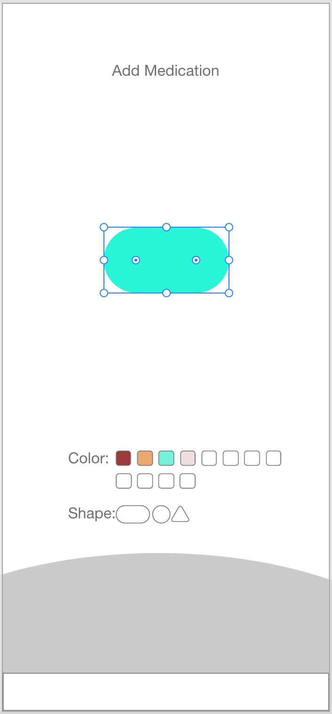
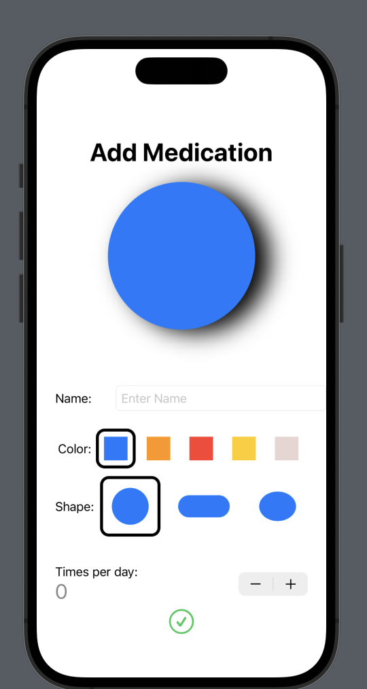
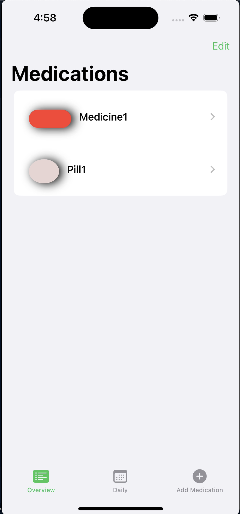
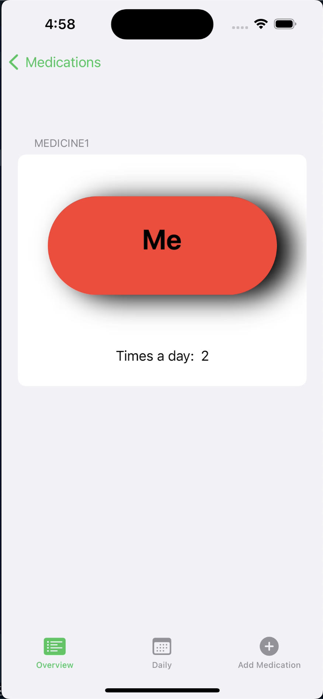
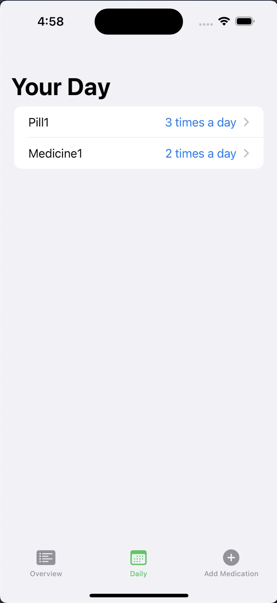

# IOS Final Project
## Overview
In this project, I will be creating a mobile application that will help users keep track of their medications. The app will allow users to add Medications, view expenses, and delete medications. The app will also allow users to view a pictoral representation of their medications. The app was developed solo using Swift and Xcode.
[Link to Google](https://www.google.com)
## Aim 
The aim of this project is to demonstrate my mastery of the design, development, and debugging cycle of mobile app development.

## Design
<!-- picture -->

I used Adobe XD to refine my idea for the app. I created a wireframe and a storyboard to help me visualize the app. 

My final implimentation of this prototyped screen is pictured below:

## Views
The app has 4 views:

### Add Medication
    This view allows users to add a medication. The user can enter the name of the medication, the shape, the frequency, and the color. The user can then click the "Add Medication" button to add the medication to the list of medications.

    

### View Medications
    This view allows users to view a list of their medications. The user can click on a medication to view more information about the medication. The user can also press edit to delete medications.
 

### Detail View
    This view allows users to view more information about a medication. The user can click the back button to return to the list of medications.

    

### Daily View
    This view allows the user to view the amount of medication they should take each day

    

## User Stories
The following functionality is complete:
* [x] User can add a medication
* [x] User can view a list of medications
* [x] User can delete a medication
* [x] User can view a pictoral representation of their medications

## IOS Guidelines
The following usability guidelines are met:
* [x] Column and Table views are used
* [x] SF Symbols are used
* [x] Dock navigation is used
* [x] User input in various forms is used

## Usability Guidelines
The following usability guidelines are met:
* [x] Consistent Asthetics
* [x] Consistent Layout
* [x] Visiblity of system status

